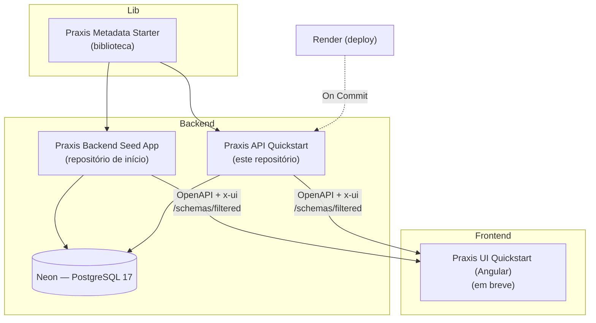
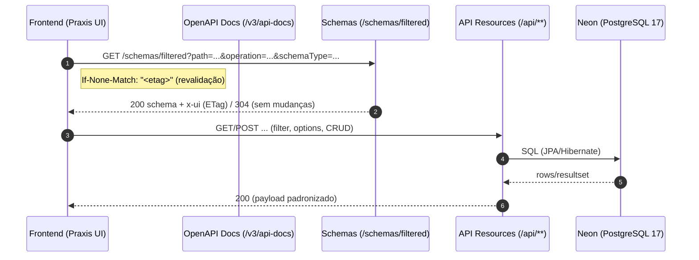

[](https://github.com/codexrodrigues/praxis-api-quickstart/actions/workflows/ci-java.yml)

# API Quickstart (Praxis Metadata Starter)


**Demo (Render)**
- Home pública: https://praxis-api-quickstart.onrender.com/
- Swagger UI: https://praxis-api-quickstart.onrender.com/swagger-ui/index.html
- Health: https://praxis-api-quickstart.onrender.com/actuator/health

## Sobre o Praxis (visão geral)

O Praxis nasce da ideia de que contratos ricos guiam a UI. Em vez de telas e APIs rígidas, descrevemos recursos com metadados — e a UI interpreta esses contratos em tempo de execução.

- Self‑describing APIs: o backend publica OpenAPI enriquecido com uma extensão x‑ui.
- UI Schema (UISchema): anotações em DTOs/entidades descrevem controles (FieldControlType), labels, validações e dicas.
- Contract‑driven: os componentes de UI (tabela, formulário) leem o contrato e se montam dinamicamente (schema‑driven UI, data‑driven forms, dynamic component rendering).
- Configuration‑driven: preferências vivem em configurações (por tenant/role), não em forks de código.
- Evolução segura: `ETag`/`If-None-Match` e versões lógicas evitam quebras e permitem cache inteligente do contrato.

Benefícios
- Menos boilerplate e menos acoplamento entre front e back.
- Mesma UI servindo múltiplos backends compatíveis com o contrato.
- Ajustes visuais e funcionais por configuração, com governança.

Como a UI consome o contrato
- Endpoints públicos: `/v3/api-docs` (por grupo) e `/schemas/filtered` (schema filtrado por operação: request/response).
- O `schemas/filtered` mescla metadados das anotações, Bean Validation e hints do OpenAPI.

## 🦸‍♂️ Universo dos Heróis (domínio de exemplo)

Este Quickstart usa um domínio temático de heróis para demonstrar CRUDs, relacionamentos e regras de negócio em um contexto lúdico e familiar.

- Plataforma: Spring Boot 3 (Java 21) + PostgreSQL 17
- Objetivo: oferecer uma base rica de dados e endpoints REST para uso com as bibliotecas do ecossistema Praxis (Metadata Starter e UI)

Módulos principais (exemplos didáticos)
- 🧍‍♂️ Recursos Humanos — funcionários, cargos, departamentos, histórico, endereços, dependentes
- 🧠 Habilidades & Identidades — habilidades, vínculos funcionário↔habilidade, identidades secretas
- 🏰 Bases & Equipes — bases operacionais, equipes e níveis de acesso
- 🛰️ Missões & Ameaças — ameaças, missões, participantes e eventos
- 🛠️ Logística & Tecnologia — equipamentos, veículos e alocações
- ⚖️ Compliance & Incidentes — acordos, licenças, incidentes e indenizações
- 🗞️ Comunicação & Mídia — sinais de socorro, reputação, menções na imprensa

Observação: neste Quickstart todos os recursos estão sob o prefixo único `/api/human-resources/...` por praticidade (agrupa o domínio de demonstração num único grupo de rotas).

Para uma visão detalhada (tabelas, views e cenários), veja: `docs/DEMO-DATABASE.md`.

## Ecossistema (peças e papéis)

- Praxis Metadata Starter (biblioteca)
  - Fornece anotações e bases para publicar contratos ricos: `@ApiResource`, `@ApiGroup`, `@UISchema`.
  - Enriquecimento OpenAPI com extensão x-ui, endpoint `/schemas/filtered`, endpoints utilitários de `options` e integrações JPA.
  - Principais pacotes usados aqui: `org.praxisplatform.uischema.annotation`, `org.praxisplatform.uischema.controller.base`, `org.praxisplatform.uischema.service.base`, `org.praxisplatform.uischema.filter`.
- Praxis Backend Seed App (projeto)
  - Repositório “esqueleto” para iniciar um backend limpo com o Starter já integrado.
  - Link: https://github.com/codexrodrigues/praxis-backend-seed-app
- Praxis API Quickstart (este repositório)
  - Exemplo completo com domínio de HR, filtros, mappers e controllers já conectados ao Starter.
  - Demonstra `/schemas/filtered`, endpoints `options`, documentação OpenAPI por grupo e deploy no Render.
- Praxis UI Quickstart (Angular) — em breve
  - UI dinâmica que consome `OpenAPI + x-ui` e monta telas em runtime (tabela/formulário/filters/options).

Para detalhes do domínio e do banco de demonstração, consulte: `docs/DEMO-DATABASE.md`.

### Diagrama do ecossistema


## Onde este projeto se encaixa

- Referência prática: mostra os padrões do Starter aplicados de ponta a ponta (entidades → DTOs com `@UISchema` → controllers base → OpenAPI enriquecido → Swagger público).
- Ponto de partida para times: copie trechos (DTOs anotados, services base, controllers) e aplique no seu domínio.
- Alternativa ao Seed: se preferir começar “do zero”, use o Seed. Se quer um exemplo mais completo para aprender/copiar padrões, use este Quickstart.

## Fluxo de alto nível (contract-driven)

- A UI solicita schema: `GET /schemas/filtered?path=<resource>&operation=<op>&schemaType=<request|response>`.
- O backend responde com contrato enriquecido (inclui `x-ui`, validações e metadados); usa `ETag/If-None-Match` para revalidar.
- A UI renderiza componentes adequados (por `FieldControlType`) e chama endpoints do recurso (`/filter`, `options/filter`, `options/by-ids`, CRUD...).

### Diagrama (contract-driven)


## Mapa do código (este repo)

- Aplicação: `src/main/java/com/example/praxis/apiquickstart/ApiQuickstartApplication.java`
- Segurança: `src/main/java/com/example/praxis/apiquickstart/config/SecurityConfig.java` — Swagger, Home e Health públicos; demais rotas com Basic Auth.
- Paths da API: `src/main/java/com/example/praxis/apiquickstart/constants/ApiPaths.java` — prefixos como `/api/human-resources/...`.
- Propriedades: `src/main/resources/application.properties` (base), `src/main/resources/application-dev.properties`, `src/main/resources/application-prod.properties`.
- Página pública: `src/main/resources/static/index.html` e assets em `src/main/resources/static/assets/`.

Pequeno projeto Spring Boot com `praxis-metadata-starter` pronto para consumir variáveis de ambiente e conectar em banco PostgreSQL (Neon), com perfis `dev` e `prod`.

## Dependências chave
- `io.github.codexrodrigues:praxis-metadata-starter` — auto-configuração, `/schemas/filtered` e enriquecimento OpenAPI x-ui.
- `org.springframework.boot:spring-boot-starter-data-jpa`
- `org.postgresql:postgresql`
- `org.springframework.boot:spring-boot-starter-security` (Basic Auth temporária)
- `org.springframework.boot:spring-boot-starter-actuator` (health checks)

## Perfis e variáveis
- Base: `src/main/resources/application.properties` — Swagger e propriedades do starter.
- Dev: `src/main/resources/application-dev.properties` — usa envs e fallback local.
- Prod: `src/main/resources/application-prod.properties` — usa envs para produção.

Ambas suportam as variáveis:
- `SPRING_DATASOURCE_URL` (preferida) ou `DATABASE_URL` (fallback)
- `SPRING_DATASOURCE_USERNAME`
- `SPRING_DATASOURCE_PASSWORD`
- `DB_POOL_SIZE` (opcional)

Arquivos de exemplo para preenchimento:
- `.env.dev.example`
- `.env.prod.example`

## Neon: converter DSN em JDBC
DSN fornecida (não comitar segredos):
```
postgresql://neondb_owner:<PASSWORD>@ep-blue-butterfly-ad8tnape-pooler.c-2.us-east-1.aws.neon.tech/neondb?sslmode=require&channel_binding=require
```
JDBC correspondente (remova `channel_binding` — o driver JDBC não utiliza):
```
jdbc:postgresql://ep-blue-butterfly-ad8tnape-pooler.c-2.us-east-1.aws.neon.tech/neondb?sslmode=require
```
Vars:
```
SPRING_DATASOURCE_URL=jdbc:postgresql://.../neondb?sslmode=require
SPRING_DATASOURCE_USERNAME=neondb_owner
SPRING_DATASOURCE_PASSWORD=<PASSWORD>
```

## Render (produção)
No dashboard do Render, defina as variáveis de ambiente:
- `SPRING_PROFILES_ACTIVE=prod`
- `SPRING_DATASOURCE_URL` (JDBC)
- `SPRING_DATASOURCE_USERNAME`
- `SPRING_DATASOURCE_PASSWORD`
- `DB_POOL_SIZE` (opcional)

Opcionalmente, se o provedor expõe `DATABASE_URL` (DSN), mantenha também `SPRING_DATASOURCE_URL` com a versão JDBC.

### Segurança (temporária)
- Todos os endpoints da API exigem Basic Auth (temporário para ambientes públicos).
- Credenciais padrão: usuário `admin` e senha via env `PRACTICE_TEMP_PASSWORD` (definida no Render). Para testes locais, se a env não estiver definida, usa `changeMe!`.
- Endpoints públicos:
  - Home: `/`
  - Swagger e OpenAPI: `/swagger-ui/**`, `/v3/api-docs/**`
  - Health check: `/actuator/health`

Exemplos de teste:
```
curl -i https://praxis-api-quickstart.onrender.com/actuator/health
# → 200 OK (público)

curl -i https://praxis-api-quickstart.onrender.com/api/human-resources/funcionarios
# → 401 Unauthorized

curl -i -u admin:$PRACTICE_TEMP_PASSWORD \
  https://praxis-api-quickstart.onrender.com/api/human-resources/funcionarios
# → 200 OK (autenticado)
```

### URLs públicas (Render)
- URL pública do Swagger UI: https://praxis-api-quickstart.onrender.com/swagger-ui/index.html
 - Home pública: https://praxis-api-quickstart.onrender.com/
 - A documentação OpenAPI usada pelo UI também está pública: `/v3/api-docs` e `/v3/api-docs/**`.
 - As demais rotas da API permanecem protegidas por Basic Auth (usuário `admin` e senha em `PRACTICE_TEMP_PASSWORD`).

### Capturas de tela
- Em breve: screenshots da Home e do Swagger UI renderizados em produção.

## Rodar local
Este quickstart usa o starter publicado no Maven Central:

- Coordinates: `io.github.codexrodrigues:praxis-metadata-starter:2.0.0-beta.0`

1) Build (repo standalone)
```
./mvnw -B -DskipTests package
# ou
mvn  -B -DskipTests package
```
2) Executar (dev):
```
# carrega .env.dev.example manualmente ou exporte variáveis
SPRING_PROFILES_ACTIVE=dev \
SPRING_DATASOURCE_URL=jdbc:postgresql://localhost:5432/neondb?sslmode=disable \
SPRING_DATASOURCE_USERNAME=postgres \
SPRING_DATASOURCE_PASSWORD=postgres \
java -jar target/praxis-api-quickstart-1.0.0-SNAPSHOT.jar
```
Swagger UI: http://localhost:8088/swagger-ui/index.html

## Endpoints úteis
- Home pública: `http://localhost:8088/`
- Swagger UI: `http://localhost:8088/swagger-ui/index.html`
- Health check: `http://localhost:8088/actuator/health`
- Schemas enriquecidos (exemplo): `/schemas/filtered?path=/api/human-resources/funcionarios&operation=post&schemaType=request`

## Padrões de SELECTs e Filtros (Options)

Quando usar `POST /{resource}/options/filter`
- Preencher selects/multi-select/autocomplete com projeção leve `OptionDTO{id,label,extra}`.
- Vantagens: payload mínimo, paginação, filtros tipados (usa o mesmo FilterDTO do recurso).
- Como configurar no `@UISchema` (campos relacionais):
  - `controlType=SELECT` (ou equivalente)
  - `endpoint="/api/.../{resource}/options/filter"`
  - `valueField="id"`, `displayField="label"`

Quando usar `GET /{resource}/options/by-ids`
- Reidratar opções por IDs já conhecidos (pré‑seleção, chips) preservando a ordem.
- Limites: respeita `praxis.query.by-ids.max`.

Quando usar `POST /{resource}/filter` (não options)
- Listagens “ricas” (tabelas/grades) que precisam do DTO completo.
- Para diálogos de seleção com muitos atributos visíveis, prefira `/filter`.

Boas práticas
- Grandes datasets: use `/options/filter` com o FilterDTO alvo (ex.: busca por nome/código).
- Pré‑seleção: reidrate com `/options/by-ids` (ordem garantida).
- Mantenha `size` moderado; utilize `X-Data-Version` para cache de listas.

### Exemplos rápidos de Options

Funcionários (options paginadas)
```
curl -s -X POST 'http://localhost:8088/api/human-resources/funcionarios/options/filter?page=0&size=10' \
  -H 'Content-Type: application/json' \
  -d '{"nomeCompleto":"ana"}' | jq .
```

Funcionários (reidratar por IDs com ordem preservada)
```
curl -s 'http://localhost:8088/api/human-resources/funcionarios/options/by-ids?ids=3,1,2' | jq .
```

Folhas de Pagamento (filter completo para tabelas)
```
curl -i -s -X POST 'http://localhost:8088/api/human-resources/folhas-pagamento/filter?page=0&size=5' \
  -H 'Content-Type: application/json' \
  -d '{"ano": 2024}' | sed -n '1,40p'
```
Observação: verifique o cabeçalho `X-Data-Version` na resposta para estratégias de cache.

### Schemas enriquecidos (/schemas/filtered)
- Solicita o schema do endpoint informando `path`, `operation` (get|post|put|delete) e `schemaType` (request|response).
- Exemplo (schema de request para criar funcionário):
  - `/schemas/filtered?path=/api/human-resources/funcionarios&operation=post&schemaType=request`

Por trás dos panos
- O backend calcula e devolve ETag do schema; o client revalida com `If-None-Match` para minimizar transferências.
- Defaults do `@UISchema` podem ser sobrescritos por valores explícitos, Bean Validation e `extraProperties`.

### Options (combos leves)
- Endpoints padrão fornecidos pelos controllers base:
  - `POST {resource}/options/filter` — pagina opções por filtro; retorna `{id,label}`.
  - `POST {resource}/options/by-ids` — retorna opções por IDs.
- Exemplos:
  - `POST /api/human-resources/funcionarios/options/filter`
  - `POST /api/human-resources/folhas-pagamento/options/by-ids`

### Novos recursos (HR)
- Cargos: `/api/human-resources/cargos`
- Departamentos: `/api/human-resources/departamentos`
- Funcionários: `/api/human-resources/funcionarios`
- Endereços: `/api/human-resources/enderecos`
- Dependentes: `/api/human-resources/dependentes`
- Folhas de Pagamento: `/api/human-resources/folhas-pagamento`
- Eventos da Folha: `/api/human-resources/eventos-folha`
- Férias/Afastamentos: `/api/human-resources/ferias-afastamentos`

### Exemplo de cURL (filter)
```
curl -s -X POST 'http://localhost:8088/api/human-resources/folhas-pagamento/filter?page=0&size=5' \
  -H 'Content-Type: application/json' \
  -d '{"ano": 2024, "funcionarioId": 1}' | jq .
```

### Exemplo de cURL (options)
```
curl -s -X POST 'http://localhost:8088/api/human-resources/funcionarios/options/filter?page=0&size=10' \
  -H 'Content-Type: application/json' \
  -d '{}' | jq .
```

## Notas
- `ddl-auto`: `update` (dev) e `validate` (prod). Ajuste conforme migrações existentes.
- Se um provedor fornecer apenas `DATABASE_URL` no formato DSN, converta para JDBC antes de setar `SPRING_DATASOURCE_URL`.
- Dependência do Praxis no Central: `io.github.codexrodrigues:praxis-metadata-starter` (nenhuma etapa prévia de build local é necessária).

## CI (GitHub Actions)

Este repositório usa CI-only (sem deploy) para build e testes com Java 21 e Maven Wrapper.

- Workflow: `.github/workflows/ci-java.yml`
- Disparos: `push` e `pull_request` na branch `main`
- Passos principais:
  - `actions/setup-java@v4` (Temurin 21, cache Maven)
  - Normalização de EOL do wrapper e `chmod +x mvnw`
  - `./mvnw -B -fae -Dstyle.color=always verify`
- Sem deploy: não há hooks, secrets ou chamadas ao Render nos workflows.

Implantação no Render (produção) deve ser configurada diretamente no painel do Render (Build/Start command e variáveis de ambiente). Não há workflow de deploy neste repositório.

## Docker (opcional)

Build da imagem e execução local sem instalar Java/Maven:
```
docker build -t praxis-api-quickstart:local .
docker run --rm -e PORT=8088 -p 8088:8088 praxis-api-quickstart:local
```
Com memória/flags JVM customizados:
```
docker run --rm \
  -e PORT=9090 -p 9090:9090 \
  -e JAVA_OPTS="-Xms256m -Xmx512m" \
  praxis-api-quickstart:local
```

## Projetos relacionados
- Seed do backend (Spring Boot): https://github.com/codexrodrigues/praxis-backend-seed-app
- Quickstart Angular: em breve

## Banco local (Docker)

Suba um PostgreSQL 17 local com Docker e conecte a aplicação usando o profile `dev`.

1) Subir o banco
```
docker compose -f dev/docker-compose.local.yml up -d db
# Aguarde o healthcheck ficar saudável
docker compose -f dev/docker-compose.local.yml ps
```

Credenciais padrão do compose:
- host: localhost
- port: 5432
- db: praxis
- user: postgres
- password: postgres

2) Importar um dump SQL existente
- Opção A — Import automático (primeiro start): copie o arquivo para `db/init/` e então rode `docker compose -f dev/docker-compose.local.yml up -d db`. A imagem oficial do Postgres executa automaticamente `*.sql`, `*.sql.gz` e `*.sh` em `/docker-entrypoint-initdb.d` quando o volume de dados ainda não existe.
- Opção B — Compose com profile de seed (qualquer momento): renomeie o dump para um nome curto (recomendado: `neon-init.sql`) e coloque em `db/dump/`, depois execute:
```
docker compose -f dev/docker-compose.local.yml --profile seed up -d db db-seed
# ou, para um arquivo com nome diferente:
SEED_FILE=meu-dump.sql docker compose -f dev/docker-compose.local.yml --profile seed up -d db db-seed
```
- Opção C — Import manual (qualquer momento):
```
bash scripts/db-import.sh /caminho/para/neon-init.sql
```

3) Apontar a aplicação para o banco local (dev)
- Via env (exemplo):
```
SPRING_PROFILES_ACTIVE=dev \
SPRING_DATASOURCE_URL=jdbc:postgresql://localhost:5432/neondb?sslmode=disable \
SPRING_DATASOURCE_USERNAME=postgres \
SPRING_DATASOURCE_PASSWORD=postgres \
./mvnw -B -DskipTests spring-boot:run
```
- As propriedades `application-dev.properties` já possuem esses defaults; setar as envs é opcional.

Observações
- Se já existir volume de dados (`db_data`), scripts em `db/init` não rodam novamente (comportamento padrão da imagem Postgres).
- Para “resetar” e importar do zero: `docker compose -f dev/docker-compose.local.yml down -v && docker compose -f dev/docker-compose.local.yml up -d db` (cuidado — destrói os dados locais).
- Dumps com `CREATE DATABASE` podem ser usados; o compose já cria a base padrão `praxis` (POSTGRES_DB). Se necessário, ajuste `DB_NAME` e `DB_USER` no profile de seed.

## Higiene de commits (o que commitar)

- Commitar:
  - `src/`, `pom.xml`, `README.md`, `LICENSE`, `AGENTS.md`, `.github/`, `.mvn/wrapper/maven-wrapper.properties`, `mvnw`, `mvnw.cmd`.
- Não commitar:
  - `target/` (artefatos de build), logs (`*.log`), dumps (`hs_err_pid*`).
  - Variáveis reais de ambiente (`.env`, `.env.*`); use somente os exemplos (`.env.*.example`).
  - Pastas/arquivos de IDE: `.idea/`, `.vscode/`, `*.iml`, `.classpath`, `.project`, `.settings/`.
  - Binários gerados temporários, arquivos de merge (`*.orig`, `*.rej`), temporários de editor (`*.swp`, `*.swo`, `*~`).

Observação
- O `maven-wrapper.jar` não é commitado por padrão; o `mvnw` baixa-o automaticamente no CI quando necessário.
